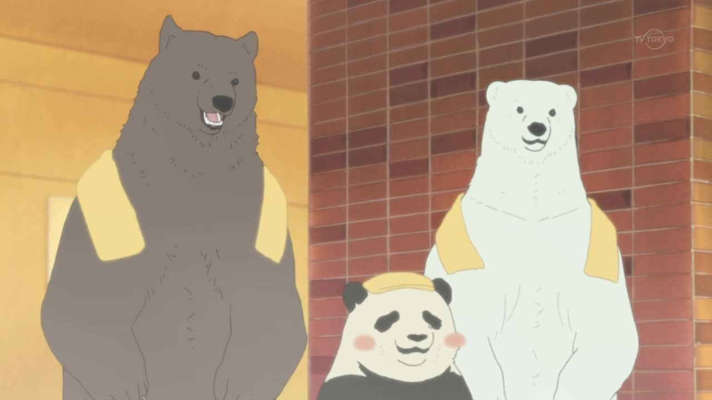

# 在白熊咖啡馆打工的两天

店长白熊桑 @qinhuai 说想在豆瓣开个白熊咖啡馆，我说反正我闲着也是闲着要不就交给我吧（大意），于是有了这个项目，就是定时把白熊咖啡馆的截图发到豆瓣广播上。

## Day 1

要完成这个工作，无非就是分三步：

1. 准备好截图
1. 准备好发广播
1. 设置定时程序

要先拿到截图就必须要有素材，素材当然就是白熊咖啡馆的片源啦，马上下载了 50 集，当然人工一张一张截图虽然也是个办法，果然还是太麻烦了，而且容易出错，规格也很难保证，于是就想着用程序去完成，就请来了 ffmpeg 桑，让他每隔 20 秒就去截一张图。

`ffmpeg -i shirokumacafe_01.mkv  -f image2 -vf fps=fps=1/20 %d.jpg`

写个遍历文件的简单代码，就可以坐等把所有截图都获取啦，50 集一共获取了 3698 张图片。然后打包传到服务器上（当然本地用也行，只要能保证一直开机运行就行）

`rsync -av --progress -e "ssh -p $ssh_port" ./images.zip $remote_dst`

然后就是研究怎么发广播，就跟平时刷广播一样，无非就是用浏览器，或者用 App。只要模拟这个过程就可能像他们一样发出广播了。这里选择了模拟 App 请求的方式，简单，方便而且有效期长。就是拿着账号密码去换 access_token，有了这个凭证就可以用它来发广播或者干其他什么事了。于是写了 `shirokumacafe.py` 这个程序，从 50 集的截图里随机挑选一张，然后发到豆瓣广播上。

最后为了让这个程序定时跑起来，只要用 `crontab -e` 设置一下就可以啦。

`0 * * * * cd /root/app/shirokumacafe && pipenv run python shirokumacafe.py`

## Day 2

上面的程序运行了一天之后，发现了一些问题，比如 OP 和 ED 的截图存在感较高，还有一些意味不明的图片，也没有办法嘛，毕竟每 20 秒截一张图的办法谁也不知道都拿到了什么样的照片。另外一个就是感觉就光秃秃一张图片未免有些单调。于是为了解决这些问题，打工第二天开始了。

为了改善机械的截图方式，想到了用台词去截图，也就是用字幕。这样一来至少是有对白的画面，质量多少会高一点儿，另外台词顺便可以当发广播的文字，一举两得，不对顺便还能当学日语的例句，一举三得了。首先就是提取字幕，用 `mkvmerge -i` 查看字幕信息，然后用 `mkvextract` 导出就行。之后就是处理这些字幕文件，提取出我们需要的截图时刻（这里简单地使用了字幕起止时间的中间作为截图点），然后合并一下中日两种文字的台词。总的来说就是 `coffee.py` 的作用了。有了这些信息，就写了 `bamboo.py` 让他去按照台词的时刻截图了，最后截了近两万张图，辛苦了 ffmpeg 桑。

OP 和 ED 出现概率高的原因是因为他们每集都有嘛，简单得改了下随机策略就解决了，先把 OP 和 ED 的截图摘出来选出一张，然后把他加到正片的截图池里再随机选一张就差不多了。

以上就是打工两天的内容啦。

